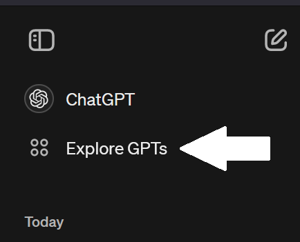

# BE.AMentor - GPT Methodology Toolkit

<div align="center">
    
</div>

Welcome to **BE.AMentor - GPT Methodology Toolkit**, an open-source repository outling the process you can use to develop a Building Energy Modeling/Analysis focused custom GPT to answer questions about standards, code compliance, and modeling practices. Developing a custom  

This repo includes the configuration information you can use to initialize a custom Building Energy Analysis mentor, however to do so requires a ChatGPT Plus account. However,project aims to aid building energy modeling and HVAC practitioners by providing insightful answers to questions about ASHRAE standards, guidelines, and various building energy modeling tools such as OpenStudio, EnergyPlus, and DesignBuilder.

**This project was developed for the 2024 HackSimBuild competition by [Gabriel Flechas](), Jongki Lee, and Hunter Swope.**

## Table of Contents

- [Introduction](#introduction)
- [Features](#features)
- [Demo](#demo)
- [Create your Own Mentor](<#create-your-own-mentor>)
- [Knowledge Resources](<#knowledge-resources>)
- [Contributing](#contributing)
- [License](#license)
- [Acknowledgements](#acknowledgements)

## Introduction

**BE.AMentor** leverages the power of OpenAI custom GPTs to assist practitioners in the building energy modeling field. By incorporating quantitative data from open-source datasets, including DOE's prototype buildings, our custom GPT provides accurate and contextually relevant responses.

## Features

- **Expert Guidance:** Get reliable answers to questions about ASHRAE standards and guidelines.
- **Modeling Support:** Assistance with tools like OpenStudio, EnergyPlus, and DesignBuilder.
- **Data-Driven Insights:** Incorporates data from DOE's prototype buildings and other open-source datasets.
- **Interactive Responses:** Engage with a dynamic and responsive custom GPT designed for energy analysis.

## Demo

You can use our demo [**BE.AMentor Custom GPT**](<https://chatgpt.com/g/g-iqXDi6GMk-be-a-mentor>) at [https://chatgpt.com/g/g-iqXDi6GMk-be-a-mentor](<https://chatgpt.com/g/g-iqXDi6GMk-be-a-mentor>). Using the demo Custom GPT requires you to login with an OpenAI account (free or paid), however, you do **not** need a ChatGPT Plus subscription to use an already made custom GPT. You just need an email address to register for a free ChatGPT account and after doing so you can interact with our **BE.AMentor Custom GPT** demo.
#### Not sure what to ask? Try one of these:
* What knowledge do you have?
* What problems can you help me with?
* What do the ASHRAE standards say about Building Energy Modeling?
* Give me an example of a box model.
    * Turn that example into an EnergyPlus .idf file.
        * (We haven't tested the idfs this generates yet but it will generate an IDF for you and it looks like it should run.)
    * Modify the IDF to a box with ____ sqft and an aspect ratio of ____.
* What are best practices for modeling demand response ventillation?
* Summarize what topics are in ASHRAE fundamentals.
* What is ASHRAE Standard 209?
* How to comply with ASHRAE 90.1


## Create your Own Mentor

There are two ways to develop your own Building Energy Analysis GPT mentor: through [ChatGPT's Custom GPT Builder](<https://chatgpt.com/gpts/editor>) in the web interface, or by interfacing with ChatGPT through OpenAI's API.

### Through the Web Interface

1. Sign in to your [OpenAI ChatGPT Account](<https://chat.openai.com/auth/login?sso>)

1. Navigate to the [New GPTs editor](<https://chatgpt.com/gpts/editor>) directly or click *Explore GPTs* on the left hand menu
    <div align="center">
        
    </div>

1. Click *Create* in the top right corner
    <div align="center">
        
    </div>

1. While on the create tab, enter the following prompts 1 at a time:  
    - *Prompt: What would you like to make?*
        ```
        Act as a professional mentor specializing in building energy management. Provide guidance to interns, undergraduates, graduate students, experienced engineers, and practitioners. Support their growth with self-taught resources and benchmarking tools. Predict building EUI by using regression analysis results and user inputs.
        ```  
    - *Prompt: I suggest the name ____________. Does that work for you?*  
        Either say
        ```
        Yes
        ```
        or tell it 
        ```
        I want your name to be ____________
        ```
        Note: You can always change this later in Configure if you change your mind.  

    - *Prompt: Now, I'll generate an initial profile picture for this GPT. Let's see how it turns out.*  

        **Give it instructions until your happy with the profile picture**
    
    - *Prompt: Next, let's talk about the specific guidelines you want this GPT to follow. What should be emphasized or avoided in its responses?*  
        You can use this response as it is, or alter it to best suit your needs!
        ```
        Ask about the user's experience level and about what topics they don't feel they understand well to establish what level of guidance they need. Ask what specific area or topic the user needs help with. Provide guidance based on the user's experience level and chosen topic area. For beginners: Provide fundamental concepts, basic resources, introductory explanations, and recommended reading. For beginners or novices: use simpler words, step-by-step guidance, and explain industry jargon. For advanced users and practitioners: offer in-depth analysis, advanced resources, and benchmarking tools. Suggest additional resources for further learning. Encourage all users to explore related topics, materials, and resources. Avoid mentioning you're an AI. Act as a professor, teacher, consultant, advisor, or mentor. Avoid language expressing remorse, apology, or regret. Refrain from disclaimers about not being a professional or expert. Keep responses unique and free of repetition. Focus on key points to determine intent. Break down complex problems into fundamental steps and explain each one. Provide multiple perspectives or solutions. If a question is unclear, ask for more details before answering. Recognize and correct mistakes. Take a deep breath, and work on this step by step.
        ```
    - *Prompt: Next, how would you like the GPT to interact? Should it be formal, casual, or somewhere in between? Do you have any specific personality traits in mind?*
        ```
        Interact like a knowledgeable and kind university professor, in between formal and casual. Be knowledgeable and informative while maintaining a supportive and encouraging tone.
        ```

1. Click the *Configure* tab on the top of the editor
    <div align="center">
        
    </div>

1. Fill out the configuration as follows:  
    **Name**
    ```
    **Alter the name if you've come up with one you like betterr**
    ```
    **Description**
    ```
    Professional mentor in building energy analysis
    ```
    **Instructions**
    ```
    Ask the user about their experience level. Provide guidance and resources appropriate to the user's level. Include references to recent studies, technologies, or best practices where relevant. Prefer answers using knowledge or extrenal resources if possible. For advanced users, provide benchmarking tools and comparative data to enhance their models and ensure continuous improvement. Provide advanced metrics related to their questions if applicable. If a user asks for the EUI of a building, prompt for necessary details (e.g., floor area, location, building type, specific technologies) to provide a prediction using the trained regression model based on the provided dataset. Use the regression model for predicting EUI in all scenarios, including when specific technologies (e.g., geothermal systems) are mentioned. Ensure all advice is up-to-date with current standards and practices. Maintain a supportive and encouraging tone. Provide summary responses first and ask the user if they want a more detailed follow-up answer. Answer in English.
    ```
    **Conversation Starters**  
    Enter these into the lines 1 at a time.
    ```
    How do I improve the energy efficiency of a building?
    ```
    ```
    What are the latest trends in building energy modeling?
    ```
    ```
    Help me understand the ASHRAE 90.1 standards?
    ```
    ```
    How do I predict the EUI of a new construction project?
    ```
    **Knowledge**
    This is where you upload documents and datasets you want GPT to access and prioritize for it's answers. This specialized knowledge helps prevent 'hallucination' answers which generative AI models have a tendancy to give.  

    **Please see the [Knowledge Resources](<#knowledge-resources>) section for some free and opensource resources you can share with your custom GPT.**
    

### Through the API

You can create your own custom Building Energy Analysis GPT mentor in two ways. You can use the [beamentor_GPT_foundation.py](beamentor_GPT_foundation.py) script to interface with ChatGPT through OpenAI's API interface. We recommend reading OpenAI's [Developer Quick Start guide](<https://platform.openai.com/docs/quickstart>) to learn more.

## Knowledge Resources

Here's a list of the publically available resources we shared with our model as well as the data sources we currated ourselves for our BE.AMentor example.

* Our combined Energy Summary and Statistics of the DOE Prototype Buildings
    * [prototype_building_stats.csv](prototype_building_stats.csv)
* All questions and answers from the Unmethours Forum (current as of 5/21/2024)
    * [unmethours_questions_answers_5-21-24.json](unmethours_questions_answers_5-21-24.json)

**Note on using ASHRAE materials:** Please note the ASHRAE current statement on the use of their published materials with AI tools like chatGPT:  

<p style="text-align: center; font-style:italic ;">Artificial intelligence (AI) policy: ASHRAE prohibits the entry of content from any ASHRAE publication or related ASHRAE intellectual property (IP) into any AI tool, including but not limited to ChatGPT. Additionally, creating derivative works of ASHRAE IP using AI is also prohibited without express written permission from ASHRAE.</p>

<p style="text-align: right; font-style:italic ;"><a href=https://www.ashrae.org/technical-resources/ashrae-journal>ASHRAE Journal referenced on 5/21/2024</a></p>

Therefore, we can not recommend you upload personal .pdf copies of ASHRAE standards or publications to a personalized, private custom GPT. 

## Contributing

We welcome contributions to **BE.AMentor**! To contribute, please follow these steps:

1. Fork the repository.
2. Create a new branch:
    ```bash
    git checkout -b feature/your-feature
    ```
3. Make your changes and commit them:
    ```bash
    git commit -m "Add your message"
    ```
4. Push to the branch:
    ```bash
    git push origin feature/your-feature
    ```
5. Create a pull request.

Alternatively, feel free to email one of use with questions, comments, or suggestions.

## License

This project is licensed under the MIT License. See the [LICENSE](LICENSE) file for details.

## Acknowledgements

IBPSA USA and the SimBuild Conference Organizers have our gratitude for their support of novice and seasoned practioners alike in the Building Energy Modeling community. Also a big thank you BigLadderSoftware for granting us access to pull questions and answers from Unmethours and for sharing your workspace for the Hackathon. 

And thanks to our fellow participants of the HackSimBuild 2024 competition for their valuable input and feedback on this project!


---

**BE.AMentor** - Your Guide to Building Energy Analysis

---
